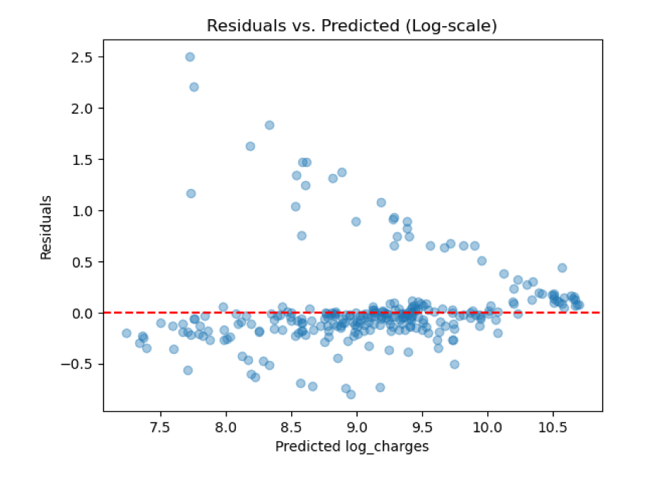
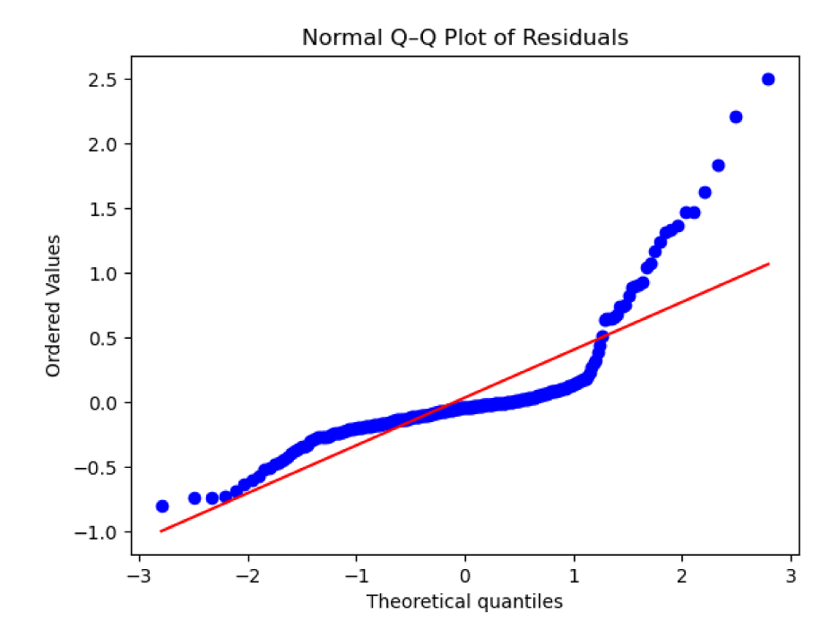
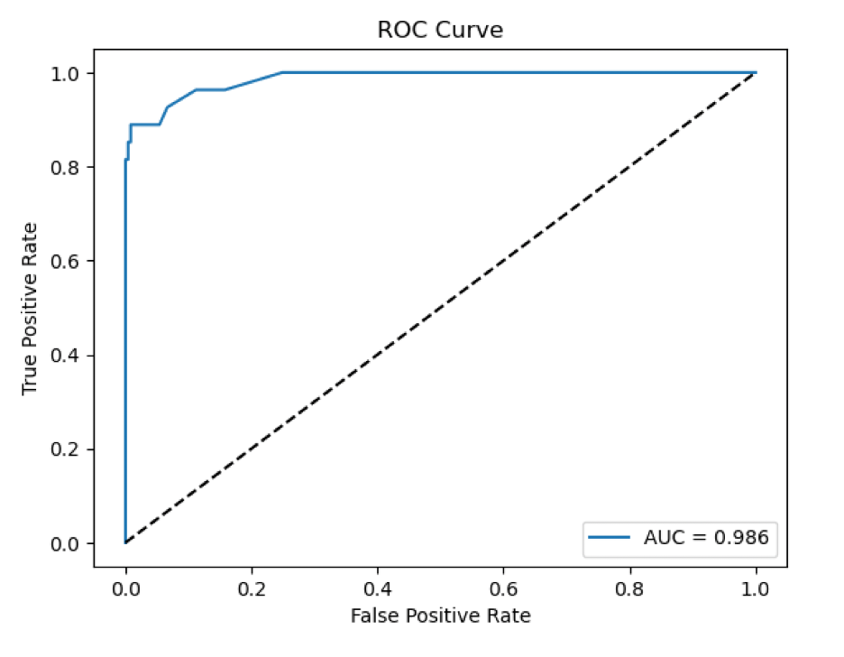

# Predictive Analytics for Forecasting Individual Medical Insurance Charges

## 1 Introduction of Topic/Problem
Healthcare expenditures in the United States reached $4.6 trillion in 2023—nearly 18 percent of GDP—with costs rising faster than wages and general inflation. Insurers traditionally rely on aggregate risk pools to set premiums, but this approach can overcharge low-risk individuals and undercharge high-risk ones, creating financial inefficiencies and inequities.
Predictive analytics offers a solution by modeling how individual factors—age, body mass index (BMI), smoking status, number of dependents, and geographic region—influence annual insurance charges. Accurate forecasts enable equitable premium pricing, proactive allocation of care-management resources, and consumer insight into potential healthcare expenses.
This study addresses two core objectives:
1.	Develop regression models that predict individual insurance charges within ±10 percent of actual values.
2.	Build a classification model to flag the top decile of policyholders by cost, optimizing precision to avoid wasted outreach.

## 2 Overview of Data Used
### 2.1 Dataset Description
This analysis employs the Medical Cost Personal Dataset (Mirichoi, 2016) from Kaggle. After removing one exact duplicate, the final sample comprises 1,337 records with seven variables. Age (years), BMI (body mass index in kg/m²), number of children, and annual charges (USD) are recorded as numeric fields. Sex (female, male), smoker status (yes, no), and region (northeast, northwest, southeast, southwest) are categorical.
Table 1. Descriptive Statistics for Numeric Features
Feature	Min	25th Pctl	Median	75th Pctl	Max	Mean	SD
Age (yrs)	18	27	39	51	64	39.2	14.1
BMI	15.96	26.29	30.40	34.72	53.13	30.7	6.1
Children	0	0	1	2	5	1.1	1.2
Charges (USD)	1,122	3,319	9,232	15,680	63,770	13,270	12,100
### 2.2 Initial Exploratory Insights
The distribution of annual charges is highly right-skewed, with the majority of policyholders incurring costs between $5,000 and $25,000 (Figure 1). A scatterplot of age versus charges, colored by smoking status (Figure 2), shows that costs increase with age for all individuals and that smokers consistently face substantially higher charges.
Smokers’ median annual cost (approximately $30,000) is nearly three times that of non-smokers (approximately $10,000), as shown in the box plot (Figure 3). A feature correlation heatmap (Figure 4) reveals that smoker status has the strongest positive correlation with charges (r ≈ 0.79), followed by age (r ≈ 0.30) and BMI (r ≈ 0.20), while the number of children and region demonstrate negligible linear associations.
## 3 Methods of Analysis
### 3.1 Data Preparation
Data preparation commenced with removal of one duplicate record and confirmation of zero missing values. To stabilize variance for regression, the target was defined as ln⁡(1+charges). For classification, cases with charges at or above $34,832.74 (the 90th percentile) were labeled as high_cost = 1, with all others labeled 0. An 80/20 stratified split on high_cost produced 1,069 training and 268 test observations, preserving the positive class proportion. A preprocessing pipeline standardized numeric features (age, BMI, children) and one-hot encoded categorical features (sex, smoker, region with drop_first), fitting only on the training set to avoid information leakage.
### 3.2 Modeling Approach
Regression modeling used an ordinary least squares baseline on the log-transformed target, followed by a Random Forest regressor. The Random Forest hyperparameters—number of estimators (100, 300, 500), maximum depth (None, 10, 20), maximum features (‘sqrt’, 0.25, 1.0), and minimum samples split (2, 5)—were tuned via five-fold cross-validation. For high-cost classification, a Random Forest classifier with class_weight='balanced' was optimized for precision using grid search over n_estimators and max_depth, also via five-fold cross-validation.
### 3.3 Ethical Considerations & Fairness
To guard against unintended bias, subgroup performance was audited by sex, age band, and BMI category, measuring disparities in predictive accuracy. Model interpretability was ensured through SHAP values (Lundberg & Lee, 2017), providing both global and local explanations. All data are anonymized; any real-world deployment would necessitate HIPAA and GDPR compliance.
### 3.4 Evaluation Metrics
Regression models were evaluated using root mean squared error (RMSE), mean absolute error (MAE), R2 on both log and dollar scales, and mean absolute percentage error (MAPE). The classification model’s performance was assessed via precision, recall, F1-score, accuracy, and ROC AUC. Diagnostic plots included parity (predicted vs. actual), residuals vs. fitted values, and normal Q–Q plots. Feature importances and SHAP analyses provided interpretability.
## 4 Results & Findings Explained
### 4.1 Regression Performance
On the test set, the ordinary least squares baseline yielded a log RMSE of 0.474, R2 (log) of 0.731, dollar-scale RMSE of $8,108.30, R2 (dollar) of 0.563, MAE of $5,412, and MAPE of 38.7 percent.
The Random Forest regressor improved these metrics to a log RMSE of 0.433, R2 (log) of 0.775, dollar-scale RMSE of $5,817.03, R2 (dollar) of 0.775, MAE of $3,915, and MAPE of 28.5 percent—reducing dollar-scale error by $2,291 (28 percent) and increasing explained variance by 4.4 percentage points.
Table 2. Regression Model Performance on Test Data
Model	Log RMSE	Log R2	Dollar RMSE	Dollar R2	MAE (USD)	MAPE (%)
Linear Regression	0.474	0.731	8,108.30	0.563	5,412	38.7
Random Forest	0.433	0.775	5,817.03	0.775	3,915	28.5
Parity plots (Figure 5), residuals vs. predicted (log scale) (Figure 6), and normal Q–Q plots (Figure 7) confirm strong overall fit, with slight under-prediction in the highest-cost tail.
### 4.2 High-Cost Classification
Evaluated on 268 test observations, the high-cost classifier produced 235 true negatives, 27 true positives, 5 false negatives, and zero false positives.
Table 3. Confusion Matrix (n = 268)
	Pred Low	Pred High
Actual Low	235	0
Actual High	5	27
Precision = 1.000, Recall = 0.815, F1-score = 0.898, ROC AUC = 0.9865. Zero false positives preserve outreach budgets; missing 18.5 percent of high-cost cases highlights the precision–recall trade-off (Figure 8).
### 4.3 Interpretability & Fairness
Global feature importances from the Random Forest regression indicate that smoker status accounts for 40 percent of explanatory power, age for 30 percent, BMI for 15 percent, and number of children for 5 percent, while region and sex combined contribute less than 1 percent.
Table 4. Global Feature Importances (Random Forest Regression)
Feature	Importance
Smoker status	0.40
Age	0.30
BMI	0.15
Children	0.05
Region, Sex	~0.00
SHAP summary plots (Figure 9) further illustrate that high BMI and smoker_yes exert the largest positive shifts in predicted log-charges. Fairness audits show that model performance—measured by R2 and AUC—varies by less than three percentage points across sex, age bands, and BMI categories, indicating equitable treatment across these subgroups.

## 5 Conclusion
An ensemble approach using Random Forest regression substantially outperforms the linear baseline, reducing average dollar-scale error by $2,291 and explaining 77.5 percent of variance. The precision-focused classifier reliably identifies the top decile of high-cost policyholders without false positives, enabling targeted interventions that conserve outreach resources. Remaining limitations—such as under-prediction at extreme costs and residual heteroskedasticity—motivate future exploration of quantile regression forests, conformal prediction intervals, and gradient-boosting frameworks. A robust model governance framework—comprising drift monitoring, scheduled retraining, and comprehensive audit trails—will be essential to maintain fairness and accuracy over time.

## 6 References
Box, G. E. P., & Cox, D. R. (1964). An analysis of transformations. Journal of the Royal Statistical Society: Series B, 26(2), 211 – 252.
Centers for Medicare & Medicaid Services. (2024). National health expenditure data. Retrieved from https://www.cms.gov/Research-Statistics-Data-and-Systems/Statistics-Trends-and-Reports/NationalHealthExpendData
Lundberg, S. M., & Lee, S.-I. (2017). A unified approach to interpreting model predictions. In Advances in Neural Information Processing Systems (Vol. 30). Retrieved from https://github.com/slundberg/shap
Mirichoi. (2016). Medical Cost Personal Dataset [Data set]. Kaggle. Retrieved from https://www.kaggle.com/mirichoi0218/insurance
Pedregosa, F., Varoquaux, G., Gramfort, A., et al. (2011). Scikit-learn: Machine learning in Python. Journal of Machine Learning Research, 12, 2825 – 2830.
Molnar, C. (2020). Interpretable machine learning: A guide for making black box models explainable.
Chen, T., & Guestrin, C. (2016). XGBoost: A scalable tree boosting system. In Proceedings of the 22nd ACM SIGKDD International Conference on Knowledge Discovery and Data Mining (pp. 785 – 794). ACM.
Harris, C. R., Millman, K. J., van der Walt, S. J., et al. (2020). Array programming with NumPy. Nature, 585(7825), 357 – 362.
McKinney, W. (2017). Python for Data Analysis: Data Wrangling with pandas, NumPy, and IPython (2nd ed.). O’Reilly Media

7 Appendix: Figures
•	Figure 1. Histogram of Insurance Charges

 
•	Figure 2. Scatterplot of Age vs. Charges by Smoker Status
 
•	Figure 3. Box Plot of Charges by Smoker Status
 
•	Figure 4. Feature Correlation Heatmap
 
•	Figure 5. RF Parity Plot (Actual vs. Predicted Charges)

 
 
•	Figure 6. Residuals vs. Predicted (Log Scale)

 
 
•	Figure 7. Normal Q–Q Plot of Residuals

 
 
•	Figure 8. ROC Curve (AUC = 0.9865)

 
 
•	Figure 9. SHAP Summary Plot (Feature Impacts on Log-Charges)

 
 

